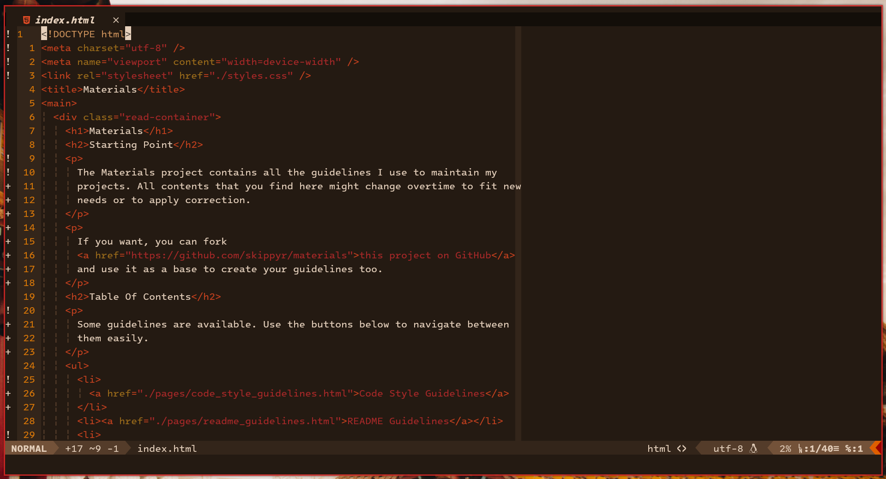
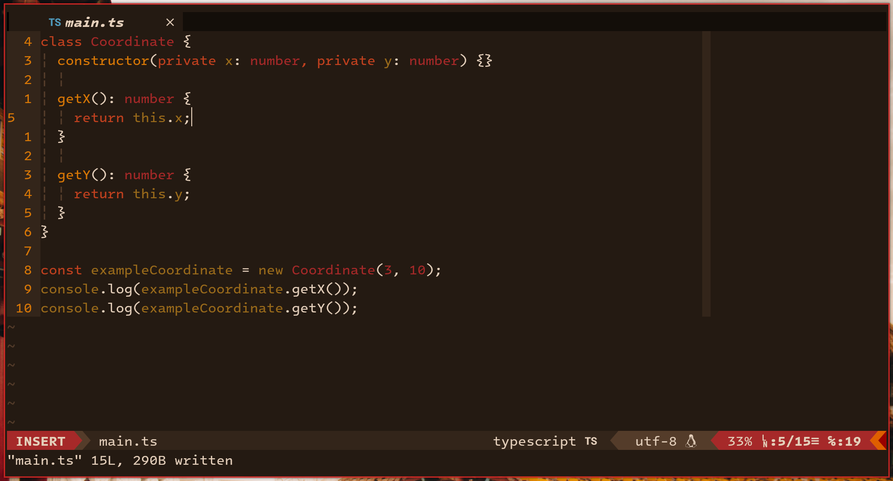

# Flamerial (Vim/Neovim)

The Flamerial (Vim/Neovim) project is the port of the Flamerial theme for Vim
and Neovim.

Here are some previews that you can check out.




> In the previews, the Flamerial theme was used in Neovim. The plugins:
> [vim-airline](https://github.com/vim-airline/vim-airline), [vim-signify](https://github.com/mhinz/vim-signify) and [Mason](https://github.com/williamboman/mason-lspconfig.nvim)
> with an LSP server for Typescript were used. Plugins can affect how the theme
> highlights in your setup.

For more ports or details about the Flamerial theme, check out its
[main repository](https://github.com/skippyr/flamerial).

## Installation

### Using A Plugin Manager

It is recommended to install this theme using a plguin manager, as it allows
you to easily update it in the future.

In this example, there will be used the plugin `vim-plug` but if you are
using other plugin manager, you can check out its own instructions. It probably
will not difer much of what you will see here.

-   When setting up your plugins, simply include this repository.

```vim
Plug 'skippyr/flamerial.nvim'
```

-   Reopen Vim/Neovim to reload the plugins list and use your plugin manager
    command to download/update them. In the case of `vim-plug`, that is:

```vim
:PlugInstall
```

### Manually

-   Clone this repository or download it from GitHub.

```bash
git clone --depth=1 https://github.com/skippyr/flamerial.nvim
```

-   Access its directory.

```bash
cd flamerial.nvim
```

-   Copy the directories to your Vim/Neovim configuration directories:

    -   For Vim:

    ```bash
    mkdir -p ~/.vim &&
    cp -r {autoload,colors} ~/.vim
    ```

    -   For Neovim:

    ```bash
    mkdir -p ~/.config/nvim &&
    cp -r {autoload,colors} ~/.config/nvim
    ```

## Usage

After you have installed the theme, you need to enable the option
`termguicolors` and apply the theme in your Vim/Neovim configuration file. This
difers depending of what language you are configuring your editor:

-   If you are using VimScript:

```vim
set termguicolors
colorscheme flamerial
```

-   If you are using Lua:

```vim
vim.cmd("set termguicolors")
vim.cmd("colorscheme flamerial")
```

The option `termguicolors` allows the theme to use colors apart from the ones
used in your terminal emulator theme. If not activated, colors will look
strange unless you use a port of the Flamerial theme for your terminal
emulator too.

That option has no effect on terminal emulators that only have support for the
3 bits color palette, normally old ones.

## Issues And Contributions

Learn how to report issues and contribute to this project by reading its
[contributions guidelines](https://skippyr.github.io/materials/pages/contributions_guidelines.html).

## License

This project is released under the terms of the MIT license. A copy of the
license is bundled with the source code.

Copyright (c) 2023, Sherman Rofeman. MIT license.

Copyright (c) 2023, Sherman Rofeman. MIT license.
