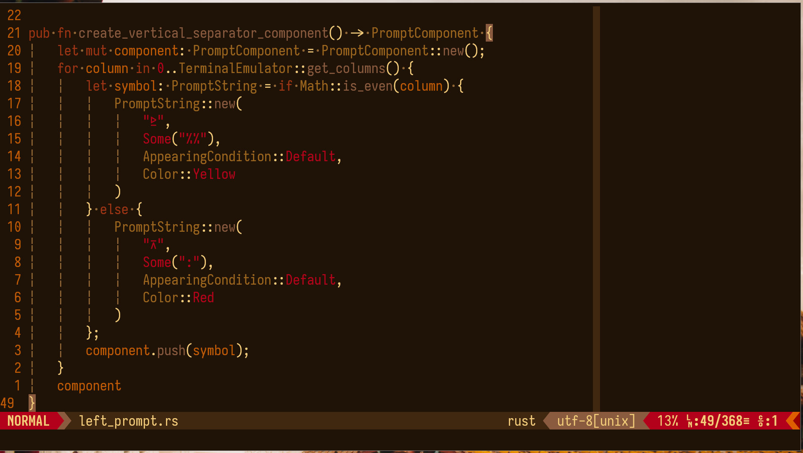

# Flamerial (Vim/Neovim)

## Starting Point

The Flamerial (Vim/Neovim) project is the port of the Flamerial theme for the
Vim and Neovim text editors.

This theme can be setup with a series of plugins, which might make it a bit
different in your setup. Here are some previews of some programming languages
highlights for you to use as reference.



> In these previews, the Flamerial theme was used to highlight HTML and Rust
  code. The text editor used was Neovim with extra highlight for Rust made by
  the [mason-lspconfig](https://github.com/williamboman/mason-lspconfig.nvim)
  plugin and the `rust-analyzer` LSP server.

For more ports and information about the Flamerial's palette, check out its
[main repository](https://github.com/skippyr/flamerial).

## Installation

You can install this theme in multiple ways, choose the one that suits you
best.

### Using A Package Manager

The easiest way of installating and managing themes and plugins for Vim and
Neovim is by using a package manager. To install this theme, you basically
need to use a rule that points to this repository when adjusting your plugins.

Here are instructions for popular package managers. If you use another one not
listed, you can refer to its documentation, but its usage might not be very
different.

* [vim-plug](https://github.com/junegunn/vim-plug)
    * Add this Plug rule to your plugins configuration:

        ```vim
        Plug "skippyr/flamerial.nvim"
        ```

    * Reopen Vim/Neovim to reload the configuration file.
    * Use the `:PlugInstall` command to download the theme.
    * Apply the theme by using the `colorscheme` rule in your Vim/Neovim
      configuration file:

        * If you are using Vim script.

            ```vim
            colorscheme flamerial
            ```

        * If you are using Lua (Neovim only).

            ```lua
            vim.cmd("colorscheme flamerial")
            ```

* [packer.nvim](https://github.com/wbthomason/packer.nvim) (Neovim only)
    * Add this `use` rule to your plugins configuration:

        ```vim
        use "skippyr/flamerial.nvim"
        ```

    * Reopen Neovim.
    * Use the `:PackerSync` command to download the theme.
    * Apply the theme by using a cmd call to the `colorscheme` rule in your
      Neovim configuration file:

        ```lua
        vim.cmd("colorscheme flamerial")
        ```

### Manually

By manually installing this theme, you will need to manually organize the file
structure and it will not be possible to easily update it.

* Install `git` and clone this repository.

    ```bash
    git clone --depth=1 https://github.com/skippyr/flamerial
    ```

* Access the repository's directory.

    ```bash
    cd flamerial
    ```

* Copy the directories `autoload` and `colors` to your Vim/Neovim configuration
  directory:

  * For Vim:

        ```bash
        mkdir -p ~/.vim &&
        cp -r {autoload,colors} ~/.vim
        ```

  * For Neovim:

        ```bash
        mkdir -p ~/.config/nvim &&
        cp -r {autoload,colors} ~/.config/nvim
        ```

* Apply the theme by using the `colorscheme` rule in your Vim/Neovim
  configuration file:

    * If you are using Vim script.

        ```vim
        colorscheme flamerial
        ```

    * If you are using Lua (Neovim only).

        ```lua
        vim.cmd("colorscheme flamerial")
        ```

## Issues And Contributions

Learn how to report issues and contribute to this project by reading its
[contributions guidelines](https://skippyr.github.io/materials/pages/contributions_guidelines.html).

## License

This project is released under the terms of the MIT license. A copy of the
license is bundled with the source code.

Copyright (c) 2023, Sherman Rofeman. MIT license.

