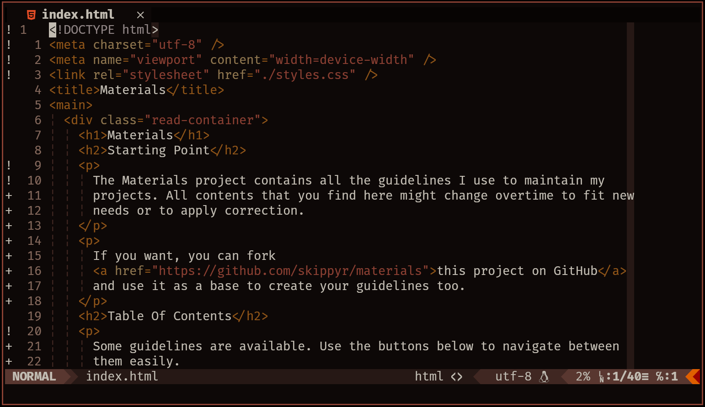

<h1>Flamerial (Vim/Neovim)</h1>
	<h2>Starting Point</h2>
		
The port of the Flamerial theme for Vim and Neovim.

		
You can find more ports and information about the Flamerial theme in its <a href="https://github.com/skippyr/flamerial">main repository</a>.

		
	<h2>Installation And Usage</h2>
		<h3>Using A Package Manager (recommended)</h3>
			
The easiest way of installating and managing themes and plugins for Vim and Neovim is by using a package manager. To install this theme, you basically need to use a rule that points to this repository when adjusting your plugins.

			
Here are instructions for popular package managers. If you use another one not listed, you can refer to its documentation, but its usage might not be very different.

			<h4><a href="https://github.com/junegunn/vim-plug">vim-plug</a></h4>
				<ul>
					<li>Add this <code>Plug</code> rule to your plugins configuration:</li>
						<pre><code>Plug "skippyr/flamerial.nvim"</code></pre>
					<li>Apply the theme by using the <code>colorscheme</code> rule in your Vim/Neovim configuration file:</li>
						<pre><code>colorscheme flamerial</code></pre>
					<li>Reload your Vim/Neovim session.</li>
					<li>Use the <code>:PlugInstall</code> command to either update or download this theme.</li>
				</ul>
			<h4><a href="https://github.com/wbthomason/packer.nvim">packer.nvim</a></h4>
				<ul>
					<li>Add this <code>use</code> rule to your plugins configuration:</li>
						<pre><code>use "skippyr/flamerial.nvim"</code></pre>
					<li>Apply the theme by using a cmd call to the <code>colorscheme</code> rule in your Neovim configuration file:</li>
						<pre><code>vim.cmd("colorscheme flamerial")</code></pre>
					<li>Reload your Neovim session.</li>
					<li>Use the <code>:PackerSync</code> command to either update or download this theme.</li>
				</ul>
		<h3>Manually</h3>
			
By manually installing this theme, you will need to manually organize the file structure and it will not be possible to easily update it.

			
For any installation step, follow these instructions first:

			<ul>
				<li>Download this repository.</li>
				
If you have <code>git</code> installed, you can download it by using the following command:

					<pre><code>git clone --depth=1 https://github.com/skippyr/flamerial.nvim</code></pre>
				
This will clone this repository to the directory <code>flamerial.nvim</code> in your current directory. If you would like to download it to another directory, simply add its path as an argument in the end of the command when you use it.

				
If you do not have <code>git</code> installed, you still can download it from its page on GitHub. Access that page, then click on the button labeled <code>Code</code> on the top of the page, the click on the button labeled <code>Download ZIP</code> that will be in the floating menu that appears. This will download a compressed file containing the repository, you just have to unzip it.

				<li>Access the repository's directory.</li>
					<pre><code>cd flamerial.nvim</code></pre>
					
If you have choosed another directory in previous step, substitute it in the command when you use it.

			</ul>
			<h4>For Vim</h4>
				<ul>
					<li>Copy the directories <code>colors</code> and <code>autoload</code> to <code>~/.vim</code>.</li>
					<pre><code>
mkdir -p ~/.vim
cp -r {colors,autoload} ~/.vim
					</code></pre>
					<li>Apply the theme by using the <code>colorscheme</code> rule in your Vim configuration file:</li>
						<pre><code>colorscheme flamerial</code></pre>
					<li>Reload your Vim session.</li>
				</ul>
			<h4>For Neovim</h4>
				<ul>
					<li>Copy the directories <code>colors</code> and <code>autoload</code> to <code>~/.config/nvim/</code>.</li>
					<pre><code>
mkdir -p ~/.config/nvim
cp -r {colors,autoload} ~/.config/nvim
					</code></pre>
					<li>Apply the theme by using the <code>colorscheme</code> rule in your Neovim configuration file:</li>
						<ul>
							<li>If you are using VimScript:</li>
								<pre><code>colorscheme flamerial</code></pre>
							<li>If you are using Lua:</li>
								<pre><code>vim.cmd("colorscheme flamerial")</code></pre>
						</ul>
					<li>Reload your Neovim session.</li>
				</ul>
	<h2>Issues And Contributions</h2>
		
Learn how to report issues, questions and ideas and how to contribute to this project by reading its <a href="https://skippyr.github.io/materials/pages/contributions_guideline.html">contributions guideline</a>.

	<h2>License</h2>
		
Flamerial is released under the MIT License. You can refer to the license as the file <code><a href="https://github.com/skippyr/flamerial.nvim/blob/main/LICENSE">LICENSE</a></code> in the root directory of this repository.

		
Copyright (c) 2023, Sherman Rofeman. MIT License.

