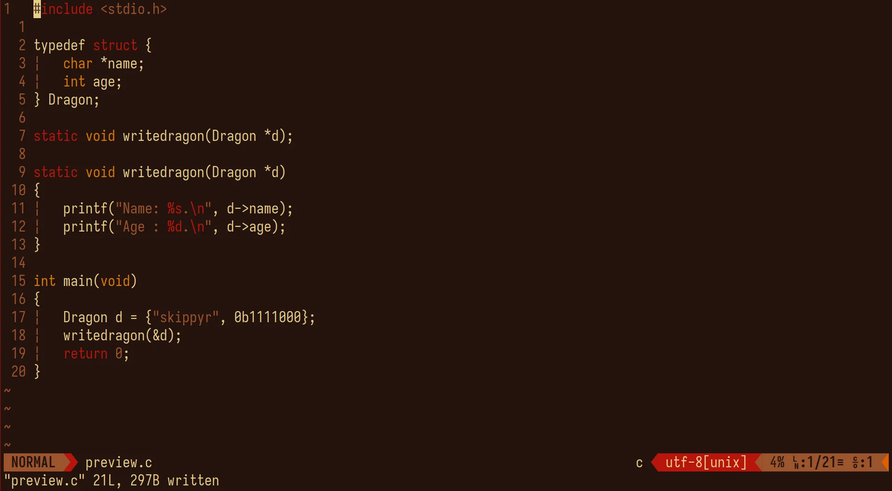

<p align="center">
	
</p>
<h1 align="center">≥v≥v&ensp;flamerial.vim&ensp;≥v≥v</h1>
<p align="center">
	
	&nbsp;
	
	&nbsp;
	
	&nbsp;
	
</p>

## ❡ About

The port of the [flamerial](https://github.com/skippyr/flamerial) theme for vim/neovim.

<p align="center"></p>
<p align="center"><sup><strong>Caption:</strong> a preview of the flamerial theme applied on vim. The font used is <a href="https://github.com/be5invis/Iosevka">iosevka</a> and status bar plugin is <a href="https://github.com/vim-airline/vim-airline">vim-airline</a>.</sup></p>

## ❡ Install

### Dependencies

The following dependencies are required to install it:

- **git**: it will be used to clone this repository.

### Manual Procedures (vim/neovim)

If you want to install it manually, without a plugin manager, follow these steps:

- Clone this repository using git:

```sh
git clone --depth 1 https://github.com/skippyr/flamerial.vim;
```

- Copy its directories to your vim/neovim configuration directory:

```sh
# For vim
mkdir -p ~/.vim;
cp -r flamerial.vim/{autoload,colors} ~/.vim;

# For neovim
mkdir -p ~/.config/nvim;
cp -r flamerial.vim/{autoload,colors} ~/.config/nvim;
```

- Apply this theme in your ~/.vimrc (for vim), ~/.config/nvim/init.vim (for neovim using vimscript) or ~/.config/nvim/init.lua (for neovim using lua) configuration file:

```vim
" For ~/.vimrc and ~/.config/nvim/init.vim
set termguicolors
syntax on
colorscheme flamerial
```

```lua
-- For ~/.config/nvim/init.lua
vim.opt.termguicolors = true
vim.cmd("syntax on")
vim.cmd("colorscheme flamerial")
```

- Reopen vim/neovim.

### Procedures For Plug (vim/neovim)

If you want to install it using the [plug](https://github.com/junegunn/vim-plug) plugin manager, follow these steps:

- Plug this repository and apply this theme in your ~/.vimrc (for vim) or ~/.config/nvim/init.vim (for neovim) configuration file:

```vim
call plug#begin()
Plug 'skippyr/flamerial.vim'
call plug#end()
set termguicolors
syntax on
colorscheme flamerial
```

- Reopen vim/neovim.
- Run the :PlugInstall command to install this theme.
- Reopen vim/neovim.

### Procedures For Packer (only neovim)

If you want to install it using the [packer](https://github.com/wbthomason/packer.nvim) plugin manager, follow these steps:

- Use this repository in your ~/.config/nvim/lua/plugins.lua plugins file.

```lua
return require("packer").startup(function(use)
	use("wbthomason/packer.nvim")
	use("skippyr/flamerial.vim")
end)
```

- Apply the theme in your ~/.config/nvim/init.lua configuration file.

```lua
require("plugins")
vim.opt.termguicolors = true
vim.cmd("syntax on")
vim.cmd("colorscheme flamerial")
```

- Reopen neovim.
- Run the :PackerSync command to install this theme.
- Reopen neovim.

## ❡ Help

If you need help about this project, open a new issue in its [issues page](https://github.com/skippyr/flamerial.vim/issues) or send me an [e-mail](mailto:skippyr.developer@gmail.com) describing what is going on.

## ❡ Contributing

This project is open to review and possibly accept contributions, specially fixes and suggestions. If you are interested, send your contribution to its [pull requests page](https://github.com/skippyr/flamerial.vim/pulls) or to my [e-mail](mailto:skippyr.developer@gmail.com).

By contributing to this project, you must agree to license your work under the same license that the project uses.

## ❡ License

This project is licensed under the MIT License. Refer to the LICENSE file that comes in its source code for license and copyright details.
